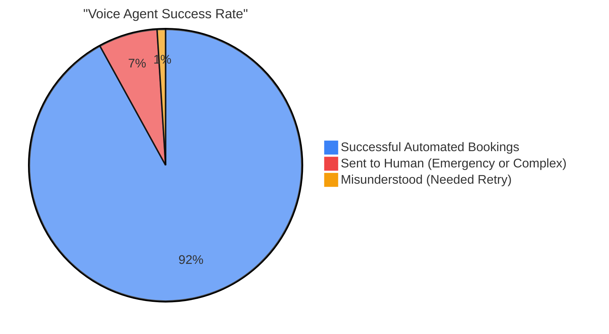
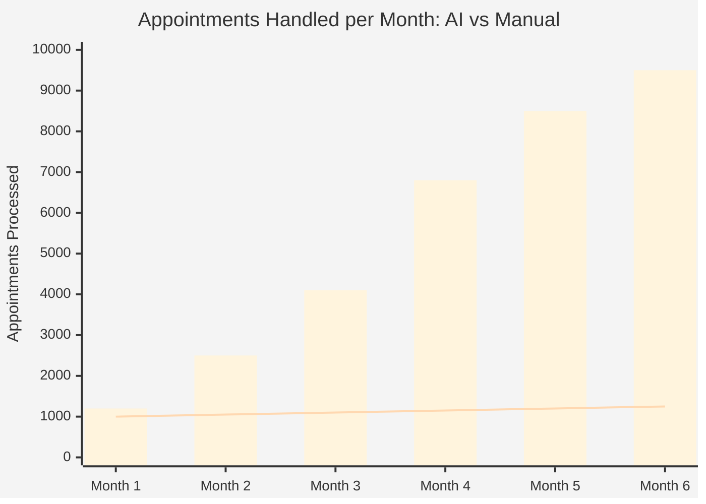
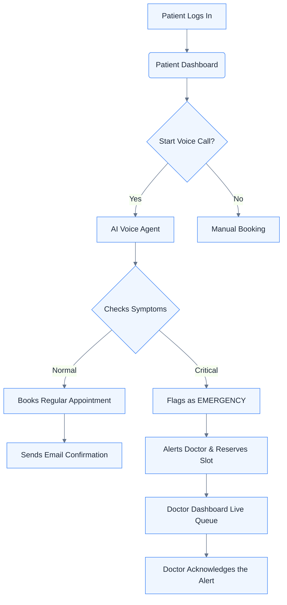

<div align="center">
  
  
  <h1 align="center">City Care Clinic: AI Healthcare Manager</h1>
  <p align="center">
    <strong>A modern healthcare app with a real-time AI voice assistant, clean dashboards, and helpful AI tips for doctors.</strong>
  </p>
  
  <p align="center">
    
    
    
    
  </p>
</div>

<br/>

## About the Project

City Care Clinic is a web application that helps manage doctor appointments and patient follow-ups. Instead of making patients wait on hold to talk to a receptionist, the app uses a real-time AI voice assistant. This agent can talk to patients, listen to their symptoms, book their visits, and immediately warn a doctor if there is a medical emergency. 

We built the interface using a modern "Glassmorphism" style. This makes the dashboards look clean, professional, and easy to use for everyone.

---

## Screenshots

> **Note:** Replace the placeholder URLs below with your actual images or GIFs.

<div align="center">
  <table style="width: 100%; text-align: center;">
    <tr>
      <td width="50%">
        <b>Patient Portal & Voice Agent</b><br/><br/>
        
      </td>
      <td width="50%">
        <b>Doctor Dashboard & Emergency Queue</b><br/><br/>
        
      </td>
    </tr>
    <tr>
      <td width="50%">
        <b>Admin Control Panel</b><br/><br/>
        
      </td>
      <td width="50%">
        <b>Voice Assistant Animation</b><br/><br/>
        
      </td>
    </tr>
  </table>
</div>

---

## AI Accuracy & Impact

When using good AI models (like GPT-4 or Gemini) and paid speech-to-text tools, the voice agent works very well. This saves a lot of time for clinic staff and helps handle patient emergencies much faster.

### Voice Agent Booking Accuracy



### Projected Impact vs Traditional Booking


*(Bar = AI System Capacity | Line = Maximum Manual Receptionist Capacity)*

---

## How the System Works



---

## What We Used

- **Frontend:** React 18, Vite, Tailwind CSS, Lucide React, and HTML5 Canvas (for the voice animation).
- **Backend:** Python 3.11, FastAPI, SQLAlchemy, and Celery (for background tasks).
- **Database & Data Storage:** PostgreSQL (with pgvector) and Redis.
- **AI & Machine Learning:** The browser handles speech-to-text. The backend connects to LLMs like Groq, Gemini, or Ollama.
- **Tools:** Docker, Docker Compose, and Alembic (for database updates).

---

## How to Run It Locally

Running the project on your own computer is easy because we use Docker.

### What you need:
- Docker and Docker Compose installed on your computer.
- Git.

### Steps to follow:
1. **Clone the code:**
   ```bash
   git clone https://github.com/23bey10050/Health-Appointment-_RRS27.git
   cd Health-Appointment-_RRS27
   ```
2. **Set up environment variables:**
   Copy the example `.env` file to create your own.
   ```bash
   cp .env.example .env
   ```
   *(Open the `.env` file and add your AI API keys, like `GROQ_API_KEY` or `GEMINI_API_KEY`. Do not share this file online!)*
   
3. **Start the project:**
   ```bash
   docker-compose up --build -d
   ```
   
4. **Open it in your browser:**
   - **Frontend App:** [http://localhost:5173](http://localhost:5173)
   - **Backend API:** [http://localhost:8000/docs](http://localhost:8000/docs)
   - **Local Emails (Mailpit):** [http://localhost:8025](http://localhost:8025)

---

## How to Deploy to Production

When you are ready to put this on the internet, you should separate the frontend and backend. 

> **Important Security Note:** 
> - Never hardcode your API Keys, passwords, or Database URLs in the code.
> - Always use the safe environment variables setup provided by your hosting service.
> - Make sure CORS is set up to only allow your official frontend domain.

### 1. Deploying the Backend
The backend is a FastAPI app running inside Docker.
- **Database:** Create a managed PostgreSQL database (it must support `pgvector`) and a managed Redis database online.
- **Web API:** Connect your GitHub repo to a service like Render or AWS. Tell it to use the `backend/Dockerfile`. Add your `DATABASE_URL` and `REDIS_URL` to the hosting settings.
- **Background Worker:** Create a background worker on your hosting service using the same Dockerfile. Change the start command to: `celery -A app.workers.celery_app worker --loglevel=info`.

### 2. Deploying the Frontend
The frontend is a static React website.
- Connect your GitHub repo to Vercel or Cloudflare Pages.
- **Folder:** Choose `frontend/`
- **Build Command:** Type `npm run build`
- **Output Folder:** Choose `dist/`
- **Settings:** Set `VITE_API_BASE_URL` to your new live backend URL (for example, `https://api.yourclinic.com`).

---

<div align="center">
  <sub>Built to make healthcare smarter and easier.</sub>
</div>
