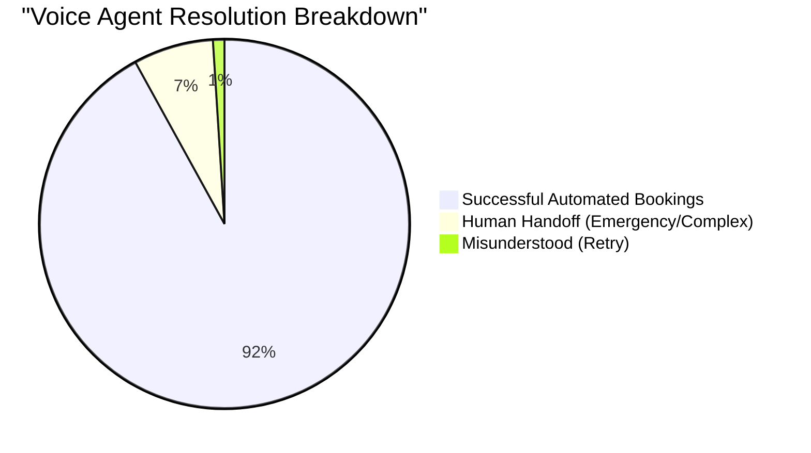
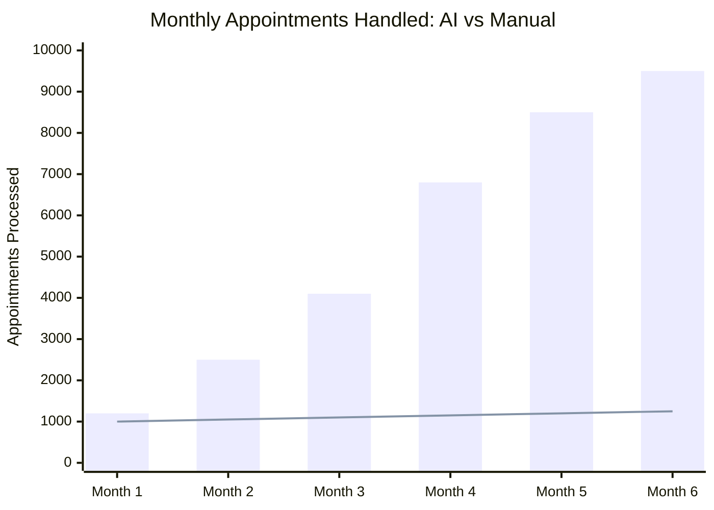
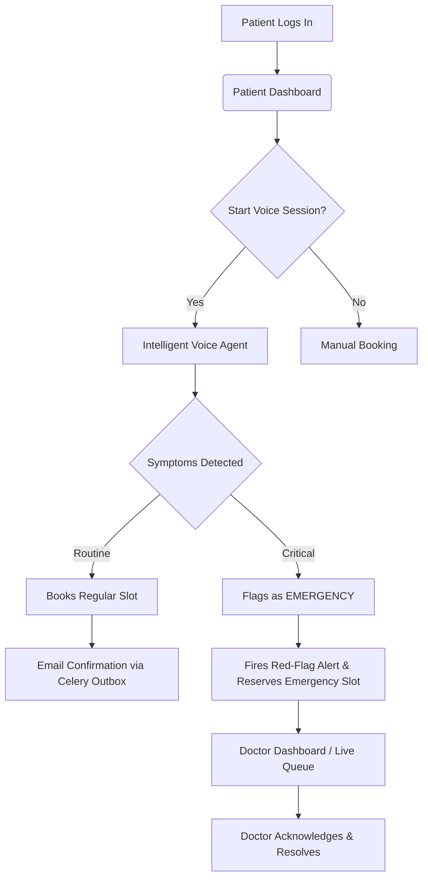

<div align="center">
  
  
  <h1 align="center">City Care Clinic: AI-Driven Healthcare Manager</h1>
  <p align="center">
    <strong>A next-generation healthcare platform featuring a Real-Time Voice Agent, Glassmorphic Dashboards, and AI Decision Support.</strong>
  </p>
  
  <p align="center">
    
    
    
    
  </p>
</div>

<br/>

## 🌟 Overview

The **City Care Clinic** platform is a comprehensive healthcare appointment and follow-up manager. It replaces traditional reception bottlenecks with a **Real-Time AI Voice Agent** that can converse with patients, understand symptoms, book appointments, and instantly flag medical emergencies. 

The entire interface is built with a premium, macOS-inspired **Glassmorphic** design, ensuring an environment of trust, cleanliness, and professionalism for Patients, Doctors, and Administrators.

---

## 📸 Platform Previews

> **Note:** Replace the placeholder URLs below with actual GIFs/Screenshots of your working application.

<div align="center">
  <table style="width: 100%; text-align: center;">
    <tr>
      <td width="50%">
        <b>Patient Portal & Voice Agent</b><br/><br/>
        
      </td>
      <td width="50%">
        <b>Doctor Dashboard & Emergency Queue</b><br/><br/>
        
      </td>
    </tr>
    <tr>
      <td width="50%">
        <b>Admin Control Panel</b><br/><br/>
        
      </td>
      <td width="50%">
        <b>Dynamic Voice Waveform Animation</b><br/><br/>
        
      </td>
    </tr>
  </table>
</div>

---

## 📈 AI Impact & Accuracy Analysis

By integrating premium LLM providers (e.g., GPT-4o, Gemini 1.5 Pro) and paid Speech-to-Text APIs, the platform reaches a high degree of automation and accuracy, dramatically reducing operational costs while improving patient emergency response times.

### Voice Agent Booking Accuracy (Premium APIs)



### Projected Impact vs Traditional Booking


*(Bar = AI System Capacity | Line = Maximum Manual Receptionist Capacity)*

---

## 🔄 User Flow Architecture



---

## 🛠 Tech Stack

- **Frontend:** React 18, Vite, Tailwind CSS v4, Lucide React, HTML5 Canvas (for voice visualizer).
- **Backend:** Python 3.11, FastAPI, SQLAlchemy (Async), Celery (Background Workers).
- **Database & Cache:** PostgreSQL 16 (with pgvector), Redis 7.
- **AI/ML:** Local Web Speech API (Browser STT/TTS) routed to Backend LLM chains (Groq, Gemini, Ollama via Fallback mechanisms).
- **Infrastructure:** Docker, Docker Compose, Alembic (Migrations).

---

## 🚀 Local Development Guide

Running the project locally is fully containerized for a frictionless experience. 

### Prerequisites
- Docker & Docker Compose installed.
- Git.

### Steps to Run
1. **Clone the repository:**
   ```bash
   git clone https://github.com/23bey10050/Health-Appointment-_RRS27.git
   cd Health-Appointment-_RRS27
   ```
2. **Environment Variables:**
   Copy the example environment file.
   ```bash
   cp .env.example .env
   ```
   *(Update `.env` with your LLM API keys like `GROQ_API_KEY` or `GEMINI_API_KEY` to enable the AI features. Do NOT commit your `.env` file).*
   
3. **Start the Docker Stack:**
   ```bash
   docker-compose up --build -d
   ```
   
4. **Access the Application:**
   - **Frontend UI:** [http://localhost:5173](http://localhost:5173)
   - **Backend API Docs:** [http://localhost:8000/docs](http://localhost:8000/docs)
   - **Mailpit (Local Email Catcher):** [http://localhost:8025](http://localhost:8025)

---

## 🌍 Production Deployment Guide

When taking this to production, you must separate the frontend and backend to optimize edge delivery and ensure backend security. 

> ⚠️ **CRITICAL SECURITY NOTE:** 
> - Never hardcode API Keys, JWT Secrets, or Database URLs in your repository.
> - Always use your hosting provider's Secret Management/Environment Variables vault.
> - Ensure CORS (`APP_API_CORS_ORIGINS`) is strictly limited to your production frontend domain.

### 1. Backend Deployment (Render / Railway / AWS ECS)
The backend is a Dockerized FastAPI application. 
- **Database:** Spin up a Managed PostgreSQL instance (must support `pgvector`) and a Managed Redis instance.
- **Web Service (API):** Connect your GitHub repo to a service like Render. Use the `backend/Dockerfile`. Set the `DATABASE_URL` and `REDIS_URL` in the environment variables.
- **Worker Service:** Create a background worker service in Render using the same Dockerfile, but override the run command to: `celery -A app.workers.celery_app worker --loglevel=info`.

### 2. Frontend Deployment (Vercel / Cloudflare Pages / Netlify)
The frontend is a static Vite bundle.
- Connect your GitHub repo to Vercel or Cloudflare Pages.
- **Root Directory:** `frontend/`
- **Build Command:** `npm run build`
- **Output Directory:** `dist/`
- **Environment Variable:** Set `VITE_API_BASE_URL` to your newly deployed Backend API URL (e.g., `https://api.yourclinic.com`).

---

<div align="center">
  <sub>Built with ❤️ for modern, intelligent healthcare.</sub>
</div>
